# Agent Hunt 网站使用 · 图文版

> **给运营 + 业务同学**：5 分钟带你过一遍 Agent Hunt 的每个页面长什么样、怎么读、典型读法。所有截图都是 1280px desktop 尺寸，2026-05-01 当天用 Playwright 拍自线上 <https://agent-hunt.pages.dev>。
>
> 配套阅读：[`产品手册-运营版.md`](./产品手册-运营版.md)（一句话定位 / 5 论断逐条 / 27 角色清单 / 误用提醒）。本文档只讲"屏幕上发生了什么 / 怎么读"。

---

## 速览 · 三轨结构

```
首页（agent-hunt.pages.dev）
   │  顶 nav：首页 / 叙事手册 / 按岗位 / 洞察报告 / 技能图谱 / 薪资分析 / 市场差异 / 行业分析 / 岗位画像
   │
   ├─ 📖 叙事手册 /narrative
   │    └─ 5 张论断卡 → /narrative/p1 ~ /narrative/p5
   │       (每页 = 大标题 + 大数字 + 一句话讲述 + 数据图 + 真实 JD 例子 + 业务话术 + 反例 caveat)
   │
   ├─ 🧭 按岗位 /roles
   │    ├─ 国内 15 角色 tab
   │    ├─ 海外 12 角色 tab
   │    └─ 详情 /roles/[market]/[roleId]（27 路径预渲染）
   │       (角色定义 + 5 核心技能 + Required vs Preferred bar + 适合谁 / 不适合谁
   │        + vs 邻居角色 + 学历 / 工作模式 / 公司 / 行业 / 真实标题样本)
   │
   └─ 📊 数据看板（7 页）
        /report     市场宏观结论
        /skills     技能频次 国内 vs 海外
        /salary     薪资分布（按经验 / 平台 / 技能）
        /gaps       国内国外技能 gap 表
        /industry   各行业 AI 渗透深度
        /insights   国内 / 国际 / 远程画像对比（手写）
```

**配色约定**：

- **国内** = 红色调（红 dot / 红薪资数字）
- **海外** = 蓝色调（蓝 dot / 蓝薪资数字）
- 国内 + 海外的图表里红 = 国内 / 蓝 = 海外。

---

## ① 首页 — 三轨入口

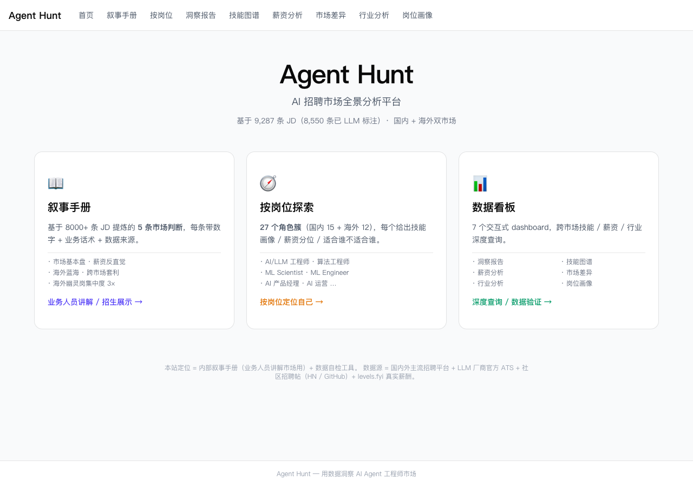

**结构（自上而下）**：

1. **顶 nav** —— 9 个链接，能直达任何页面
2. **大标题 + 数据锚点** —— `9,287 条 JD（8,550 条已 LLM 标注）· 国内 + 海外双市场`（runtime 拉，每次刷新都是最新 footer 时间戳）
3. **三张卡片**：
   - 📖 **叙事手册** —— 业务人员讲解 / 招生展示
   - 🧭 **按岗位探索** —— 27 角色簇，按岗位定位自己
   - 📊 **数据看板** —— 深度查询 / 数据验证

**话术钩子**：你给业务方介绍这个网站时，用首页这三张卡作为"网站做什么"的速答。三个轨道分别对应三种使用场景，**别把它讲成一个产品 / 一个工具**。

---

## ② 叙事手册列表 /narrative

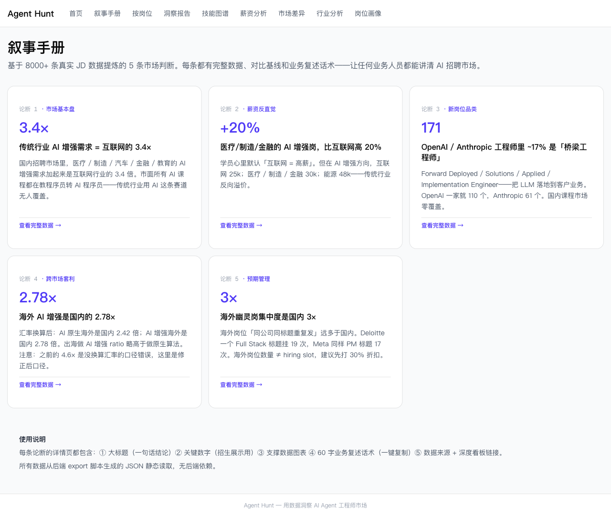

**结构**：5 张卡片（论断 1-5），每张含：

- 论断编号 + 类目（市场基本盘 / 薪资反直觉 / 新岗位品类 / 跨市场套利 / 预期管理）
- 大数字（招生展示直接用：3.4× / +20% / 171 / 2.78× / 3×）
- 大标题（一句话结论）
- 60 字摘要

**怎么读**：

- 直播 / 招生时按 P1→P5 顺序讲，每条对应学员一种心智误判：
  - P1 打破"AI = 程序员"
  - P2 打破"互联网 = 高薪"
  - P3 打破"AI 工程师 = 算法/调模型"
  - P4 打破"出海 = 4-5×"
  - P5 打破"LinkedIn 海岗多 = 我能投到"

---

## ③ 论断 1 · 国内传统行业 AI 增强需求 = 互联网的 3.4×

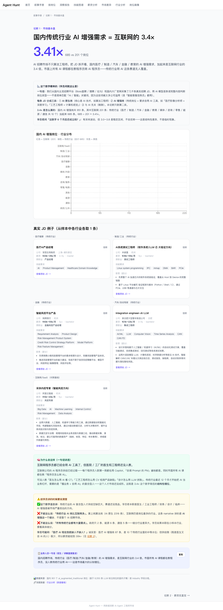

**v0.11 论断详情页通用结构**（5 篇都长这样）：

1. **顶部** —— 面包屑 `叙事手册 / 论断 1 · 市场基本盘` + 大标题 + 大数字 + 一句话总结
2. **「这个数字哪来的（学员问就这么答）」** —— 灰底卡，写明分子分母、计算口径、数据来源（招聘平台名）。**这一段直接复制就能回答用户质疑**。
3. **数据图表** —— 行业柱状图（横条 / 纵条），按 JD 数排序
4. **「真实 JD 例子」** —— 从样本中各取 1 条 JD（公司 / 标题 / 城市 / 经验 / 学历 / 技能 / 描述）
5. **「为什么会这样（一句话讲透）」** —— 绿底卡，业务因果解释
6. **「给学员讲时怎么说清」** —— 黄底 caveat 卡，✅ 这条数字适合讲什么 / ❌ 不能这么说 / ❌ 不能这么说
7. **「业务人一句话讲」** —— 蓝底卡，60 字话术，**带"复制"按钮**
8. **页脚** —— 数据源 + 深度看板链接 + 上一/下一论断

**怎么用**：

- **写公众号 / 小红书**：直接抄第 7 段「业务人一句话讲」+ 第 4 段一条真实 JD 例子。
- **应对用户质疑**：第 2 段的口径说明 + 第 6 段的 caveat 直接当 FAQ。
- **数据自检**：第 1 段大数字 + 第 8 段数据源是数字溯源链。

---

## ④ 论断 2 · 医疗 / 制造 / 金融 AI 增强岗，比互联网高 20%

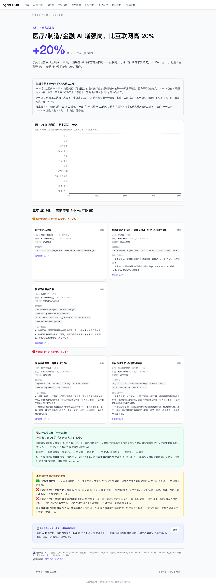

**关键看图**：

- **行业 × 薪资中位横条图** —— 高薪传统行业（金融 / 医疗 / 制造）跟互联网对比一目了然
- **真实 JD 对比卡** —— 高薪传统 vs 互联网各放 2 条 JD，让"反向溢价"用 1 条具体例子坐实

**怎么读**：

- 学员说"互联网才高薪"时，把这页截图发过去，让他自己看。
- 不要单独挑能源 48k 当卖点（样本 n=11 太小，详情页有 caveat 提示）。

---

## ⑤ 论断 3 · OpenAI / Anthropic 工程师里 ~17% 是「桥梁工程师」

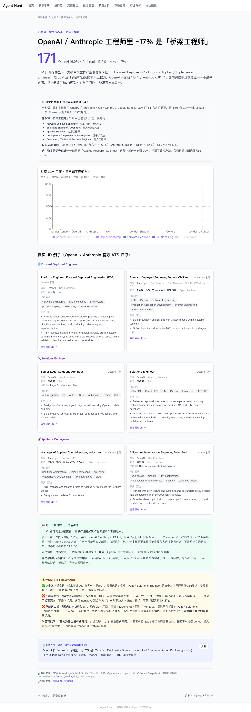

**关键看图**：

- **5 家 LLM 厂柱状图** —— OpenAI 16.9% / Anthropic 13.5% / 中位 17%（含 Cohere / DeepMind / xAI）
- **真实 JD 例子按子类组织** —— Forward Deployed Engineer / Solutions Engineer / Applied Deployment / Implementation Engineer 各取样

**怎么用**：

- 学员问"出海做什么岗位"时，这页就是答案：**桥梁工程师**这个名称是国内课程市场没有的细分品类。
- 详情页底部有"学员可问的实操问题"段，直接当 FAQ 用。
- ⚠️ 强调门槛：5 年工程经验 + 客户沟通 + 英文演讲三合一，**不是入门赛道**。

---

## ⑥ 论断 4 · 海外 AI 增强是国内的 2.78× （汇率换算后口径）

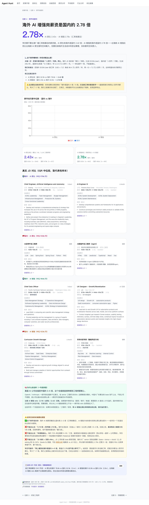

**关键看图**：

- **顶部 caveat 卡** —— 黄底，专门讲"4.6× 是没换算汇率的口径错"。
- **国内 vs 海外薪资中位柱状图** —— ai_native + ai_augmented 各一组对比
- **两个大数字 ratio**：2.43× (AI 原生) · 2.78× (AI 增强)
- **真实 JD 对比** —— 海外 + 国内各取代表性样本（IQR 中位附近）

**怎么用**：

- 任何讲跨市场套利 / 出海薪资差距的内容，**都必须引用站上 2.43-2.78 倍版本**，不能引用网传 4-5 倍。
- 详情页底部 caveat 强调"购买力差距 ≠ 名义薪资差"。讲学员这条一定要带这层提示。

---

## ⑦ 论断 5 · 海外幽灵岗集中度是国内 3×

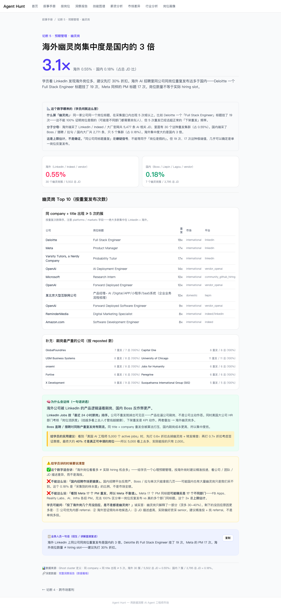

**关键看图**：

- **2 个数字方块** —— 海外 0.55% / 国内 0.18%
- **Top 10 幽灵岗表格** —— Deloitte 19× / Meta 17× / Varsity Tutors 17× / OpenAI 14× / Microsoft 10× / OpenAI 10× / 某北京大型互联网公司 10× / OpenAI 9× / ReminderMedia 8× / Amazon 8×
- **同岗最严重的公司补充列表** —— 被 100% 重发的公司（GlobalFoundries / Capital One / USM Business Systems / U Chicago / Onsemi / Jobs for Humanity / Fortive / Peregrine / X Development / Susquehanna）

**怎么用**：

- 学员看 LinkedIn 一万条 active jobs 兴奋时，截这一页，让他先打 30% 折扣再算可投岗。
- ⚠️ 详情页有 caveat 提示：「19 次重发不一定 = 假岗」，话术里说「**疑似幽灵岗**」更稳妥，不要绝对化。

---

## ⑧ 岗位画像列表 · 国内 15 角色 /roles

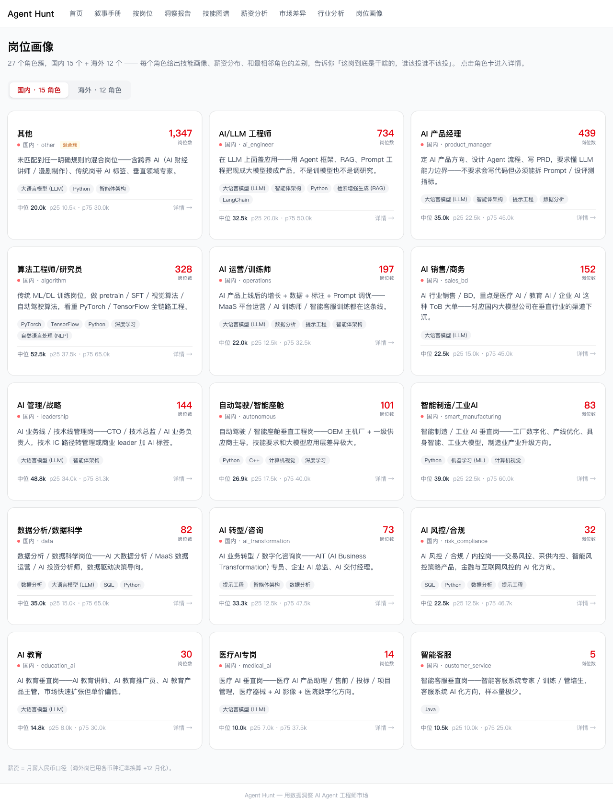

**结构**：

1. **顶部说明** —— 27 个角色簇 = 国内 15 + 海外 12
2. **国内 / 海外切换 tab**（默认国内）—— 国内是红 dot，海外是蓝 dot
3. **角色卡 grid（3 列）** —— 每张卡：
   - 角色名 + market dot + role_id（slug，如 `ai_engineer`）
   - 红色大数字 = JD 数
   - 一句话角色描述
   - 5 个核心技能 chip
   - 中位月薪 + p25 / p75 区间

**注意「混合簇」标签**：国内 `other` 1,347 条 + 海外 `Other` 1,443 条带「混合簇」黄标，**不要单独引用为一个角色**。

**怎么用**：

- 学员"我想做 AI 不知道做啥"时，让他打开这页，国内 / 海外按需切换，按 JD 数从大到小看，3 分钟选 2-3 个感兴趣的进详情。
- 你写自媒体内容前先在这里翻角色卡的 5 个核心技能 chip，确保你写的技能词跟数据一致。

---

## ⑨ 岗位画像列表 · 海外 12 角色

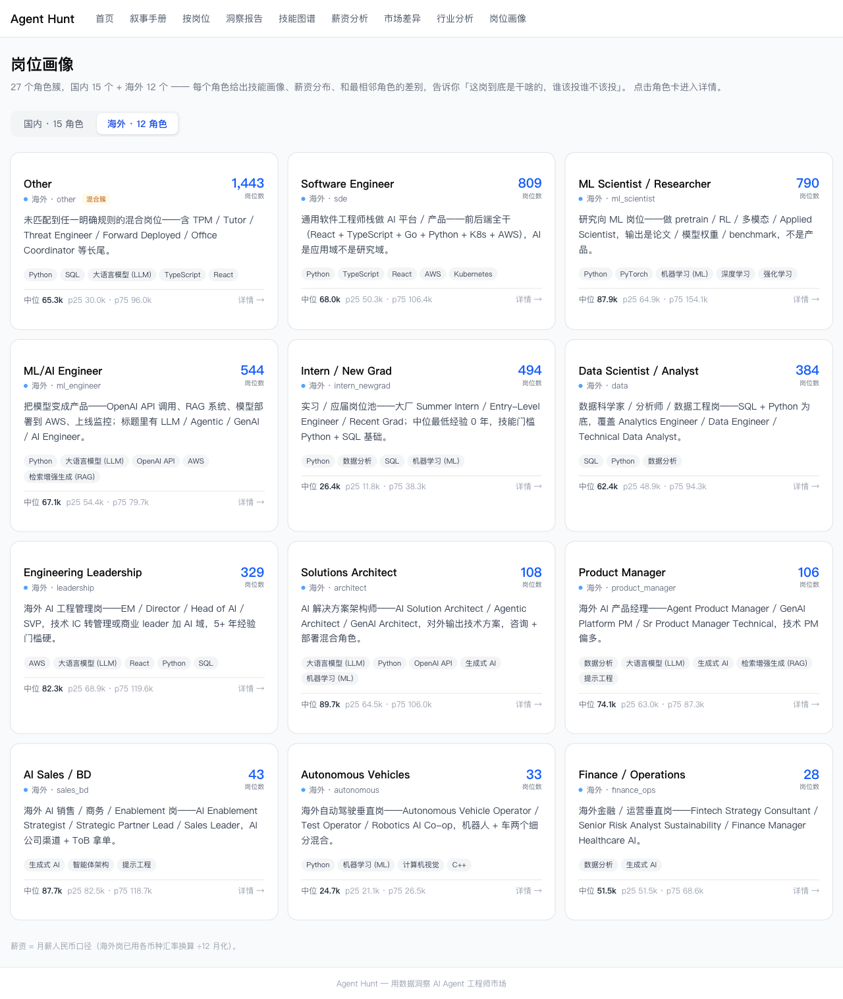

**和国内 tab 的差别**：

- 蓝 dot / 蓝色大数字
- 角色名是英文（Software Engineer / ML Scientist / ML/AI Engineer / Intern / Data Scientist / Engineering Leadership / Solutions Architect / Product Manager / AI Sales / Autonomous Vehicles / Finance Ops + Other）
- 中位月薪明显高（各币种汇率换算 ÷12 月化后口径）

**怎么读**：

- 想出海 / 想做海外 remote 的学员看这一栏。
- ⚠️ Intern / New Grad 中位 26.4k（月薪 CNY 等价）看起来低，是因为初级月薪折算后的样子。**别拿这个数字当海外校招天花板**——base + 股权打满是另一回事，详情页能看到 P75。

---

## ⑩ 角色详情 · 以「AI/LLM 工程师」为例 /roles/domestic/ai_engineer

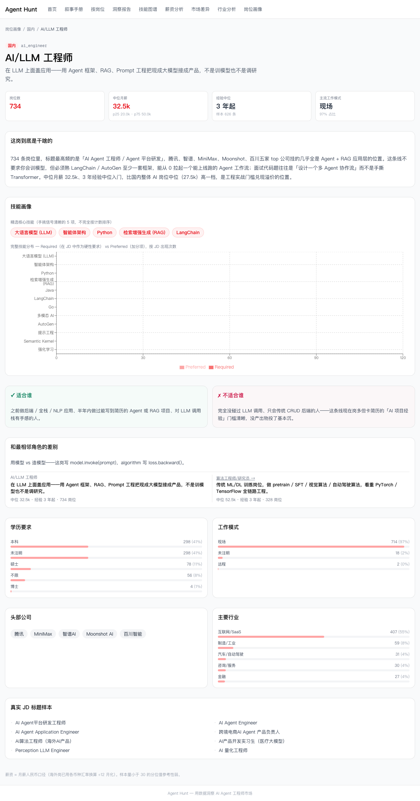

**v0.11 角色详情通用结构**（27 个详情页都长这样）：

1. **面包屑 + 角色名 + role_id slug + 一句话定义**
2. **4 个 hero stat**：岗位数 / 中位月薪（含 p25-p75）/ 经验中位 / 主流工作模式
3. **「这岗到底是干啥的」** —— 100-200 字 narrative，含具体公司名 + 工作场景
4. **技能画像** —— 5 个核心技能 chip + Required vs Preferred 横条 bar 图（按 JD 出现次数）
5. **「适合谁」 + 「不适合谁」** —— 绿底 + 红底两块对比卡
6. **和最相邻角色的差别** —— vs_neighbor 卡，左本角色 / 右邻居角色，并列对比 + 一句话差别（例：AI/LLM 工程师 vs 算法 = 用模型 vs 造模型）
7. **学历分布 / 工作模式分布** —— 横条统计
8. **头部公司 + 主要行业** —— chip + 横条
9. **真实 JD 标题样本** —— 6-10 条原始 JD 标题

**怎么用**：

- 1V1 学员定位：把第 5 段（适合谁 / 不适合谁）和第 6 段（和邻居的差别）发给学员让他自己判断。
- 面试候选人对位：候选人说"我做过算法"，让他先看 algorithm 详情页确认对位准确，避免他用算法话术投 ai_engineer 岗（或反过来）。
- 招生话术对位：你说"AI 产品经理 35k"前，先翻 product_manager 详情页确认中位数 + 学历分布。

---

## ⑪ 数据看板 · 洞察报告 /report

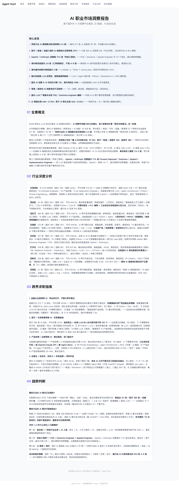

**结构**：4 章节长文报告

1. **核心发现**（10 条）—— 浓缩版的 5 论断 + 角色 + 跨市场关键数字
2. **全景概况** —— 国内 / 海外 / 真实薪酬 / 求职画像四个数据切片汇总
3. **行业深度分析** —— 12 个行业逐个简评（互联网 / 制造 / 医疗 / 金融 / 媒体 / 咨询 / 汽车 / 零售 / 教育 / 能源 / 政府 / insurance）
4. **跨界求职指南** —— 4 条转 AI 路径 + 趋势判断

**怎么用**：

- 给老板/同事 5 分钟看完整个市场轮廓时，把这页 PDF 化或截图分章节发。
- ⚠️ 这个 dashboard 上的文字部分目前是手写的（OpenRouter 余额敏感时不跑 LLM），口径跟 5 论断 / 27 角色保持一致。每次大版本会重写。

---

## ⑫ 数据看板 · 技能图谱 /skills

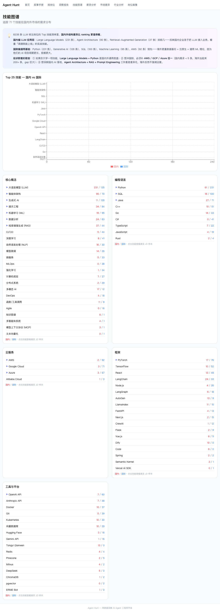

**结构**：

1. **顶部说明** —— 国内 LLM 应用核 / 国内独占特色 / 国际通用底座 / 技能差异聚类（4 类技能特征）
2. **Top 25 技能横条图** —— 国内（红） vs 国际（蓝），全样本
3. **技能分类列表** —— 6 大类（核心概念 / 编程语言 / 云服务 / 框架 / 工具与平台 / 等），每条技能标"国内 / 国际"占比

**怎么用**：

- 学员问"我该学啥"时，按学员目标（国内/出海）选对应红/蓝高频技能。
- 写技能侧自媒体内容（"国内 LLM 工程师必会的 5 个技能"）时，从这里挑数字。
- ⚠️ 占比小数（如 0.1%）样本量低，注意 chip 上的"国内 / 国际"标签是按主导市场标的。

---

## ⑬ 数据看板 · 薪资分析 /salary

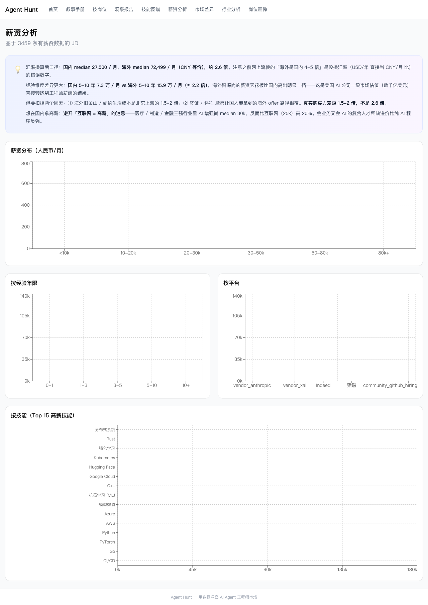

**结构**：

1. **顶部黄底 caveat** —— **重要**：明示汇率换算口径 + "海外是国内 4-5 倍是网传错"
2. **薪资分布柱状图** —— 按区间（<10k / 10-20k / 20-30k / 30-50k / 50-80k / 80k+）
3. **按经验年限折线图** —— 0-1 / 1-3 / 3-5 / 5-10 / 10+
4. **按平台横条** —— Anthropic / xAI / Indeed / 猎聘 / GitHub hiring 等
5. **按技能（Top 15 高薪技能）** —— 横条

**怎么用**：

- 学员问"我 5 年经验值多少钱"时，到这页看"按经验年限"折线图（区分国内 / 海外）。
- 学员说"远程薪资低"时，到"按平台"那块对比，看远程岗（vendor / GitHub hiring / HN）vs 招聘平台。
- ⚠️ 顶部 caveat 要让学员看完——是这个页面的最强卖点。

---

## ⑭ 数据看板 · 市场差异 /gaps

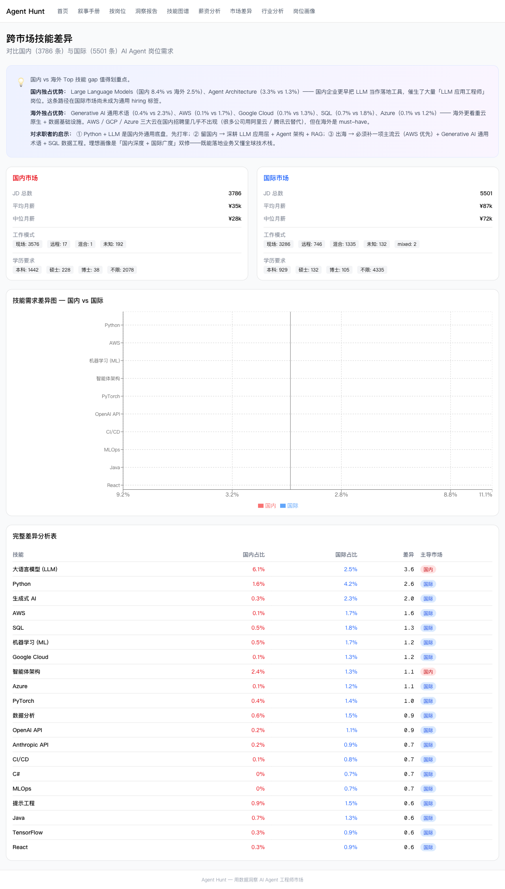

**结构**：

1. **顶部 light bulb** —— 国内独占优势 / 海外独占优势 / 对求职者的启示，三段总结
2. **左右两块概览卡** —— 国内（3,786 JD）/ 国际（5,501 JD）总体数字
3. **技能需求差异图** —— 国内 vs 国际全部 25+ 技能差异横条图
4. **完整差异表** —— 技能 / 国内占比 / 国际占比 / 差异值 / 主导市场标签

**怎么用**：

- 学员选出海 vs 留国话术对照：让他看"国内独占 vs 海外独占"两段，对比哪些技能"在国内白学"或"在海外必备"。
- 顶部一段「对求职者的启示」（Python+LLM 通用底座 / 留国深耕 LLM+Agent / 出海 AWS+SQL）是站内最浓缩的对求职者建议，可直接复制到 1V1 话术。

---

## ⑮ 数据看板 · 行业分析 /industry

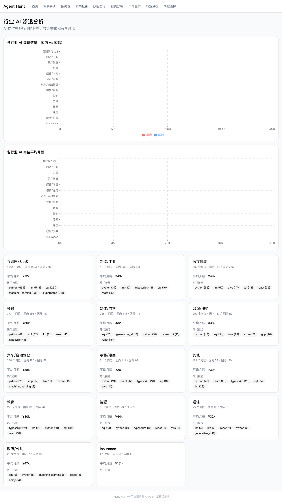

**结构**：

1. **行业 × 岗位数横条图**（国内 vs 国际）—— 互联网/SaaS / 制造 / 医疗 / 金融 / ...
2. **行业 × 平均月薪横条图**
3. **12 个行业卡片 grid** —— 每张：行业名 / JD 数（国内/国际拆分）/ 平均月薪 / 热门技能 chip

**怎么用**：

- 学员说"我在医疗行业，AI 转型该学什么"时，找到「医疗健康」卡，看热门技能 chip。
- 写行业切片公众号（"教育行业 AI 招聘全景"）时，把对应行业卡截图 + 热门技能 chip 当 PPT。
- ⚠️ 行业基数差异大（互联网/SaaS 4,182 vs insurance 1），样本 < 30 的行业**只用作大方向参考**，不要列具体薪资。

---

## ⑯ 数据看板 · 岗位画像 (insights) /insights

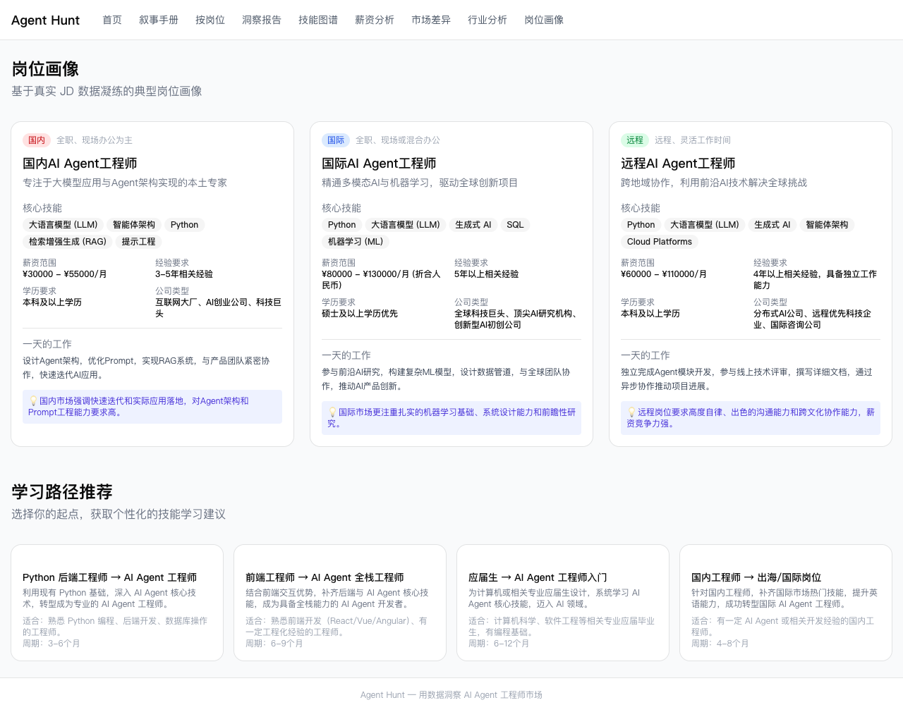

**结构**：3 张并列对比卡 + 4 条学习路径

1. **国内 AI Agent 工程师** —— 全职、现场办公为主
2. **国际 AI Agent 工程师** —— 全职、现场或混合办公
3. **远程 AI Agent 工程师** —— 远程、灵活工作时间

每张卡：核心技能 chip / 薪资范围 / 经验要求 / 学历要求 / 公司类型 / "一天的工作"

**这页跟 `/roles` 的差别**：

| 维度 | `/roles` 角色画像（27 角色） | `/insights` 岗位画像（3 风格） |
|---|---|---|
| 数据来源 | 27 角色聚类（数据驱动） | 手写代表性画像（不是聚类） |
| 用途 | 学员定位 / 1V1 对位 | 国内 / 国际 / 远程**风格化对比** |
| 数字精度 | 真实统计中位 / 分位 | 风格化的薪资 range |

**怎么用**：

- 想给学员一个国内 vs 国际 vs 远程的**风格直觉**时用这页。
- 想要精确的 27 角色统计时去 `/roles`。
- ⚠️ 不要拿这页的 30k-55k / 80k-130k / 60k-110k 数字当统计口径——那是手写代表性 range，**不是站上聚类后的 P25/P75**。

---

## 常用入口速查

| 想做什么 | 直接打开 |
|---|---|
| 做招生海报 / 直播开场 | `/narrative`（5 张大数字卡） |
| 给学员讲一条具体论断 | `/narrative/p1` ~ `/narrative/p5` |
| 学员定位"我适合啥岗位" | `/roles` → 选国内/海外 → 翻角色卡 |
| 1V1 对位 / 面试候选人 | `/roles/domestic/<role_id>` 或 `/roles/international/<role_id>` |
| 给老板 5 分钟看市场轮廓 | `/report` |
| 学员问"我学啥技能" | `/skills`（国内 vs 海外）+ `/gaps`（差异启示） |
| 学员问"我值多少钱" | `/salary`（按经验/平台/技能） |
| 写行业切片公众号 | `/industry` |
| 国内 vs 国际 vs 远程风格化讲解 | `/insights` |

---

## 不需要做的事 · 不要混入 aijobfit 那套漏斗

Agent Hunt 没有：

- ❌ 加微信
- ❌ 激活码（站点完全开放）
- ❌ 软门槛遮罩
- ❌ 用户表单 / 报告生成
- ❌ 用户数据收集

如果学员想做诊断报告（个人匹配度 / 缺什么 / 怎么补），把他引到 [aijobfit](https://aijobfit.llmxfactor.cloud) 走那边的漏斗。Agent Hunt 是**给你看的工具**，不是给学员看的产品。

---

## 上线前自测清单

发自媒体内容 / 直播展示之前，你应该能不假思索答出：

- [ ] 这个网站是给运营/业务自己看的，不是给求职者用 → ✅
- [ ] 学员要诊断报告引到哪？答：[aijobfit](https://aijobfit.llmxfactor.cloud)
- [ ] 5 论断分别叫什么？答：市场基本盘 / 薪资反直觉 / 新岗位品类 / 跨市场套利 / 预期管理
- [ ] 27 角色国内多少海外多少？答：国内 15 + 海外 12
- [ ] "海外是国内 4-5 倍" 这话对吗？答：不对，是没换汇率的口径错，正确是 2.43× / 2.78×
- [ ] "其他/Other" 簇能单独引用吗？答：不能，是混合杂项簇
- [ ] 数据多久更新一次？答：每周日 02:00 UTC（GitHub Actions cron）
- [ ] 用户问数据怎么来的，怎么答？答：9,287 条真实 JD 文本 + LLM 解析 + 跨币种汇率换算到 CNY 月薪
- [ ] P5 幽灵岗 19 次能直接说"幽灵岗"吗？答：说"疑似幽灵岗"更稳妥
- [ ] 智能客服中位 10.5k 能当卖点吗？答：不能，n=5 样本太小
- [ ] 国内 + 海外能混着算"全市场平均"吗？答：绝对不行，必须分别独立分析

---

## 常用资源链接

- 生产：<https://agent-hunt.pages.dev>
- 产品手册：[`产品手册-运营版.md`](./产品手册-运营版.md)
- 下游消费方 aijobfit：<https://aijobfit.llmxfactor.cloud>
- 数据源代码（GitHub）：<https://github.com/LLM-X-Factorer/agent-hunt>
- 工程文档：[`docs/agent-hunt/`](../agent-hunt/)
- 内容创作工作流：[`content/README.md`](../../content/README.md)
